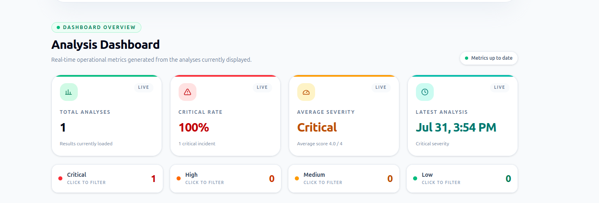
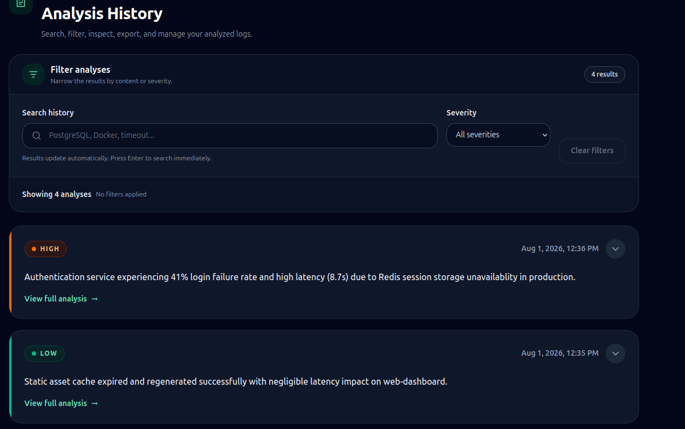

# 🚀 DevOps AI

> AI-powered platform for analyzing infrastructure logs using Google Gemini.


---

## 📖 Overview

DevOps AI is a full-stack SaaS application that leverages Google's Gemini AI to analyze infrastructure and application logs.

The platform automatically classifies incidents by severity, identifies the most likely root cause, provides actionable recommendations, and stores analysis history for authenticated users.

---

## ✨ Features

- 🔐 JWT Authentication
- 🤖 AI-powered log analysis
- 📊 Interactive dashboard
- 📁 Analysis history
- 🔍 Search and filtering
- 🗑 Delete analyses
- 🐳 Docker & Docker Compose
- 📈 Severity statistics
- ⚡ Fast React + Vite frontend
- 🗄 PostgreSQL persistence

---

## 🏗 Architecture

```text
                React + TypeScript
                       │
                       ▼
                Express REST API
                       │
         ┌─────────────┴─────────────┐
         ▼                           ▼
     PostgreSQL                Google Gemini
                       │
                       ▼
                 Docker Compose
```

---

## 🛠 Tech Stack

### Frontend

- React
- TypeScript
- Vite
- Tailwind CSS

### Backend

- Node.js
- Express.js

### Database

- PostgreSQL

### AI

- Google Gemini API

### DevOps

- Docker
- Docker Compose

---

## 📸 Screenshots

Coming soon...

---

## 🚀 Getting Started

### Clone the repository

```bash
git clone https://github.com/yourusername/devops-ai.git
cd devops-ai
```

### Configure environment variables

```bash
cp backend/.env.example backend/.env
```

Fill your credentials.

### Run with Docker

```bash
docker compose up -d --build
```

---

## 🌐 Application

| Service | URL |
|----------|-----|
| Frontend | http://localhost:5173 |
| Backend | http://localhost:3000 |
| PostgreSQL | localhost:5433 |

---

## 📂 Project Structure

```text
backend/
frontend/
database/
docker-compose.yml
README.md
```

---

## 🧪 Roadmap

- [x] JWT Authentication
- [x] Gemini AI Integration
- [x] Docker Support
- [x] Dashboard
- [x] Analysis History

### Next Version

- [ ] Deploy to Production
- [ ] CI/CD Pipeline
- [ ] Monitoring
- [ ] Export Reports
- [ ] Role-Based Access Control

---

## 📸 Screenshots

### 🔐 Login


### 📊 Dashboard



### 🤖 AI Analysis


### 📚 History




## 🎥 Demo

A complete walkthrough of the application is available in:

`docs/demo/devops-ai-demo.mp4`


## Source code available upon request for recruitment purposes.###

## 👨‍💻 Author

Francisco Vargas

Backend • Frontend • DevOps • AI

---

## 📄 License

## 📄 License

Copyright © 2026 Francisco Vargas
All rights reserved.
